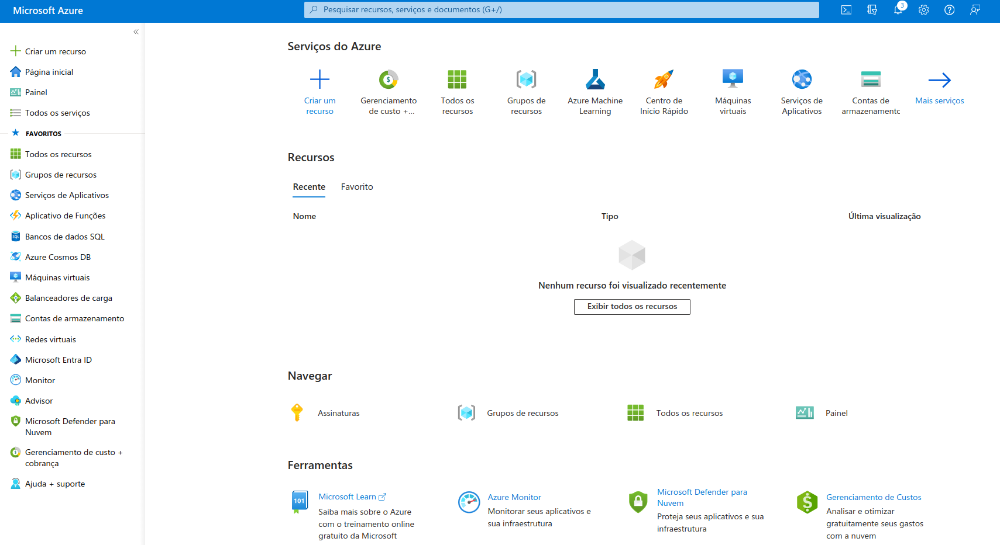
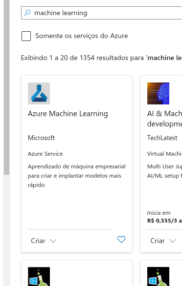
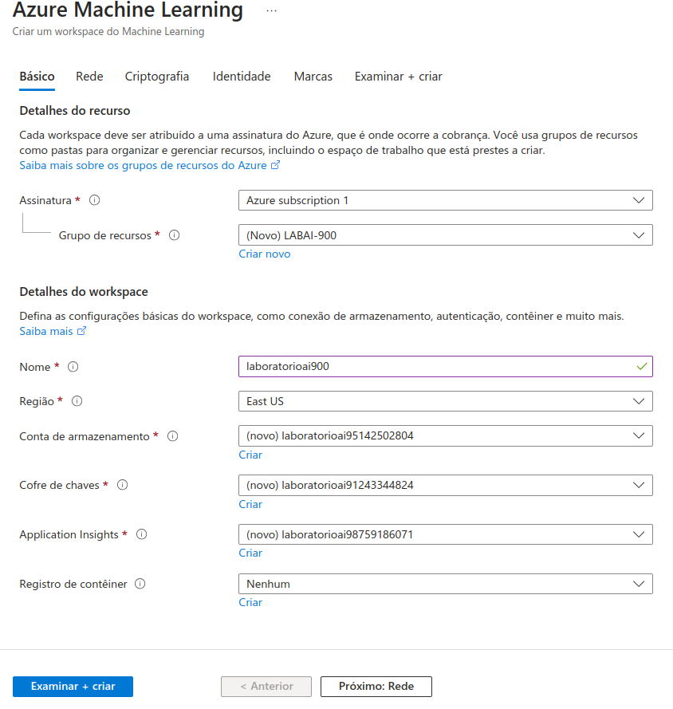
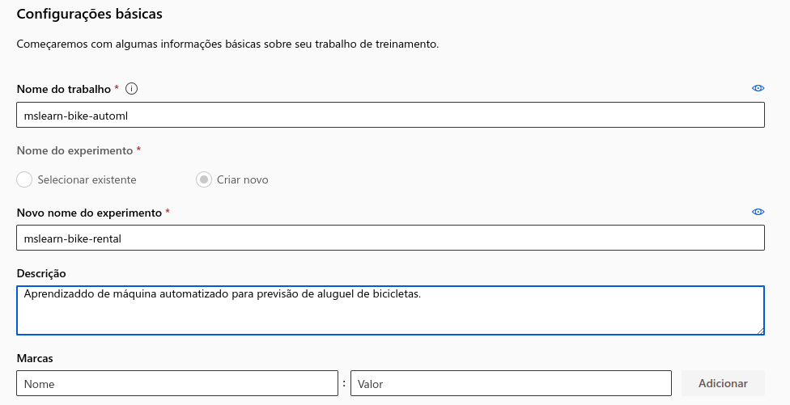
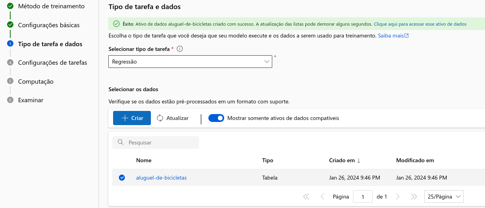
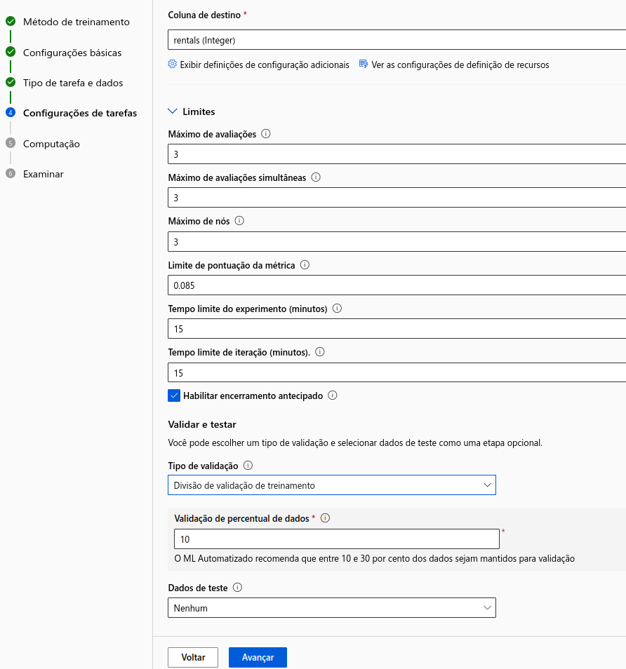
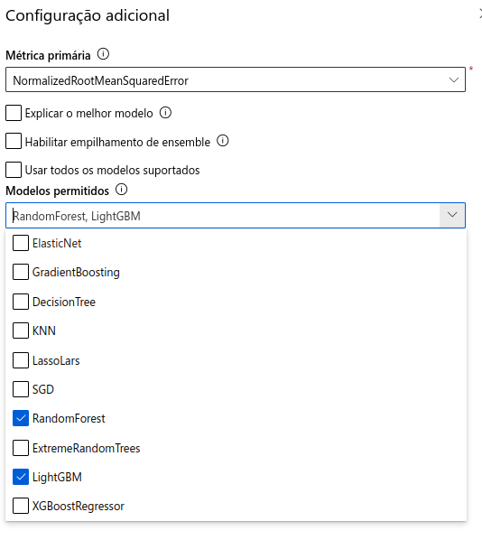
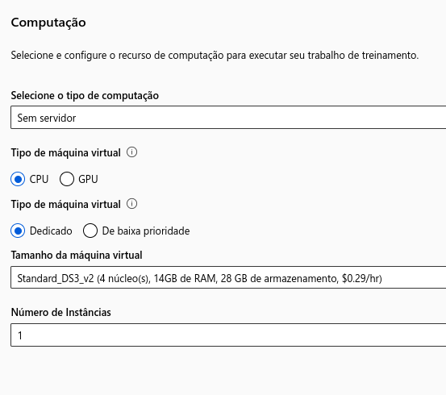
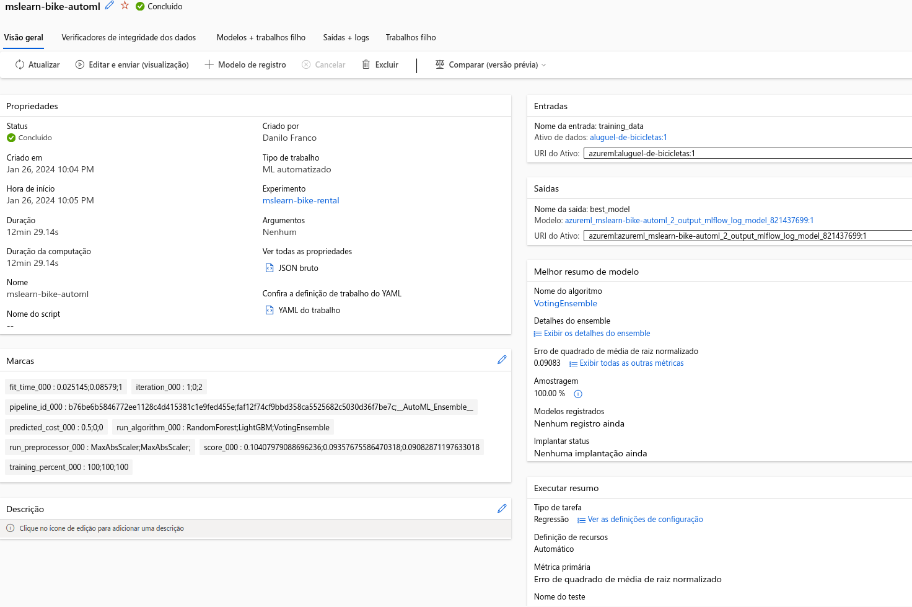
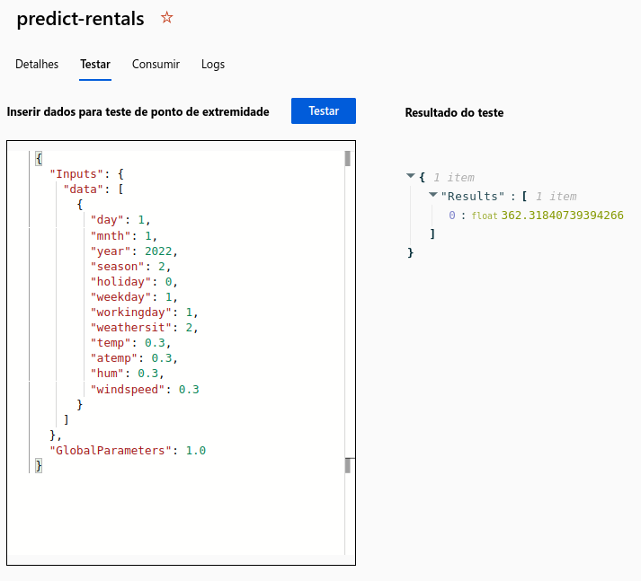

# Explorando o Azure Machine Learning

 
&nbsp &nbsp &nbsp &nbsp

## Apresentação

Demonstra-se aqui uma atividade realizada com o serviço de nuvem Azure Machine Learning. Tal atividade faz parte de um dos laboratórios do **Bootcamp Microsoft AI Fundamentals**, oferecido pela [Dio](https://www.dio.me/) em parceria com a Microsoft.

Nas linhas seguintes serão descritos os passos desde a configuração dos recursos até a inferência (predições) do modelo gerado utilizando-se do modelo de Machine Learning automatizado, serviço este que será configurado no Azure.

Sobre *implantação*, *inferência* e *pontos de extremidade*, consultar a seção Referências ao final deste artigo. Tais termos serão utilizados neste artigo. Outro ponto a salientar é que pressupõe-se o leitor, ao desejar repetir os procedimentos, já tenha uma conta registrada na Microsoft Azure.

## Criando um workspace

### 
Utilizaremos o Machine Learning Studio para criarmos nosso modelo. Antes, contudo, devemos primeiramente acessar o portal *https://portal.azure.com* e, uma vez que já tenha registrado sua conta, a tela deve apresentar um painel como abaixo:

Selecione `Criar um recurso` e busque por *Azure Machine Learning*. Selecionando o recurso, na página seguinte clique em `Criar`.

Para o nosso laboratório, a aba `Básico` foi configurada como abaixo:

Acima, note que o campo `Assinatura`já vem preenchido automaticamente; o texto poderá ser diferente, a depender do tipo de conta que se faz o acesso.

Em `Grupo de recursos` crie um novo ou selecione caso já possua.
`Conta de armazenamento`, `Cofre de chaves` e `Application Insights` serão preenchidos automaticamente, não sendo necessário alterá-los.

Clique em `Examinar + criar`. Confirme na próxima tela e clique em `Criar`. Com o workspace, vamos para o recurso, clicando em `Ir para o recurso`. Em seguida iniciamos o Azure Machine Learning Studio.

No estúdio Azure Machine Learning, você deverá ver seu espaço de trabalho recém-criado. Caso contrário, selecione `Todos os espaços de trabalho` no menu à esquerda e selecione o espaço de trabalho que você acabou de criar.

## Criando um Modelo de ML Automatizado
 
 Clique no workspace criado e na barra lateral à esquerda escolha o item `ML automatizado`. Na próxima tela crie um `Novo trabalho de ML automatizado`. Preencha os campos de cada tela e clique em avançar. No nosso caso, os campos foram preenchidos como na sequência de figuras abaixo.
 

Em `Tipo de tarefas e dados`, siga a sequência:

- *Selecionar tipo de tarefa*: Regressão;
- *Selecionar os dados*:  clique em Criar;	
    - `Tipo de dados`
		   - *Nome*: aluguel-de-bicicletas
		   - *Descrição*: Dados históricos de aluguéis de bicicletas
		   - *Tipo*: tabular
	- `Fonte de dados`
		- *De arquivos da web*
			- Preencha com a url https://aka.ms/bike-rentals
	- `Configurações`
		- *Formato de envio*: Delimitado
		- * Delimitador*: Vírgula
		- *Codificação*: UTF-8
		- *Cabeçalhos de Coluna*: Somente o primeiro arquivo tem cabeçalho
		- *Ignorar linhas*: Nenhuma
		- *Conjunto de dados com dados de várias linhas*: Deixe desmarcado
	- `Esquema`- Todas colunas marcadas, exceto *Path*
	-  `Examinar`- Clique em *Criar*
	
Aparecerá uma página como a seguinte. Marque *aluguel-de-bicicletas* e clique em *Avançar* para ir para `Configurações de tarefas`. 
	

Em Configurações de tarefas preencha como segue:

Ainda com relação à figura anterior, abaixo de *Coluna de destino*, vá em *Exibir definições de configurações adicionais* e deixe preenchido como abaixo:

Em `Computação` deixamos como na figura:

Por fim clique em avançar, onde irá para a guia `Examinar`e em seguida clique em `Enviar trabalho de treinamento`. O processo pode demorar até 15 min.

## O Melhor Modelo Gerado

Quando o trabalho automatizado de aprendizado de máquina for concluído, você poderá revisar o melhor modelo treinado.

No card *Melhor resumo de modelo* clique no link abaixo do *Nome do algoritmo*,  assim obterá mais detalhes do modelo.

Na aba *Métricas*, revise os gráficos que mostram o desempenho do modelo. O gráfico de resíduos mostra os resíduos (as diferenças entre os valores previstos e reais) como um histograma. O gráfico predicted_true compara os valores previstos com o valor verdadeiro

## Validando o Modelo

Na guia Modelo para obter o melhor modelo treinado pelo seu trabalho de aprendizado de máquina automatizado, selecione Implantar e use a opção de serviço Web para implantar o modelo com as seguintes configurações: 
- Nome: prever aluguéis 
- Descrição: Prever aluguel de ciclo 
- Tipo de cálculo: Instância de Contêiner do Azure
-  Habilitar autenticação: selecionado

Após isso,  no menu esquerdo, selecione *Pontos de extremidade* e abra o endpoint em tempo real de previsão de aluguel. Na página do endpoint em tempo real de previsão de aluguel, visualize a guia Testar.  Substituímos o campo pelo conteúdo do arquivo `dados_teste.json` e clicamos em *Testar*.

O resultado retorna o valor previsto com novos dados de entrada.

## Referências
- [Pontos de extremidade para inferência na produção](https://learn.microsoft.com/pt-br/azure/machine-learning/concept-endpoints?view=azureml-api-2)
- [Explore Automated Machine Learning in Azure Machine Learning](https://microsoftlearning.github.io/mslearn-ai-fundamentals/Instructions/Labs/01-machine-learning.html)
- 
