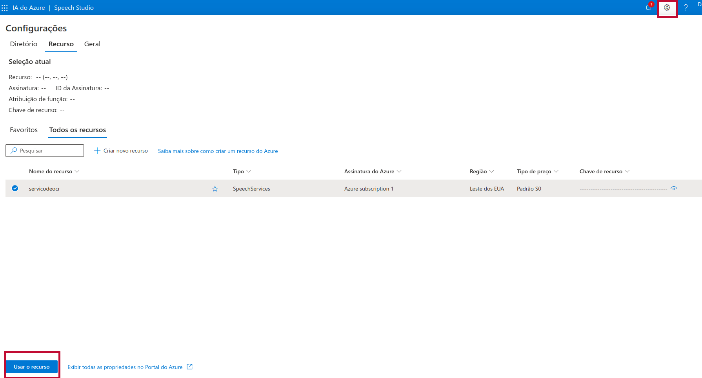
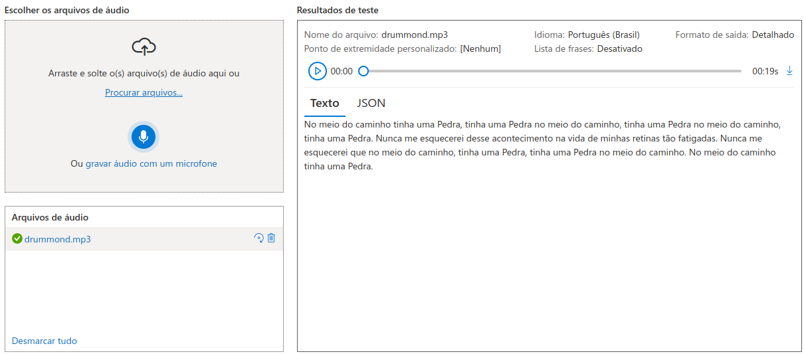
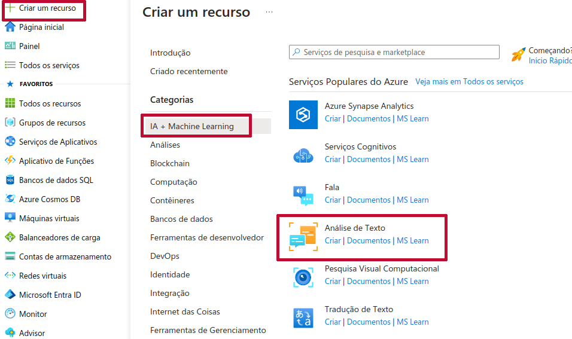
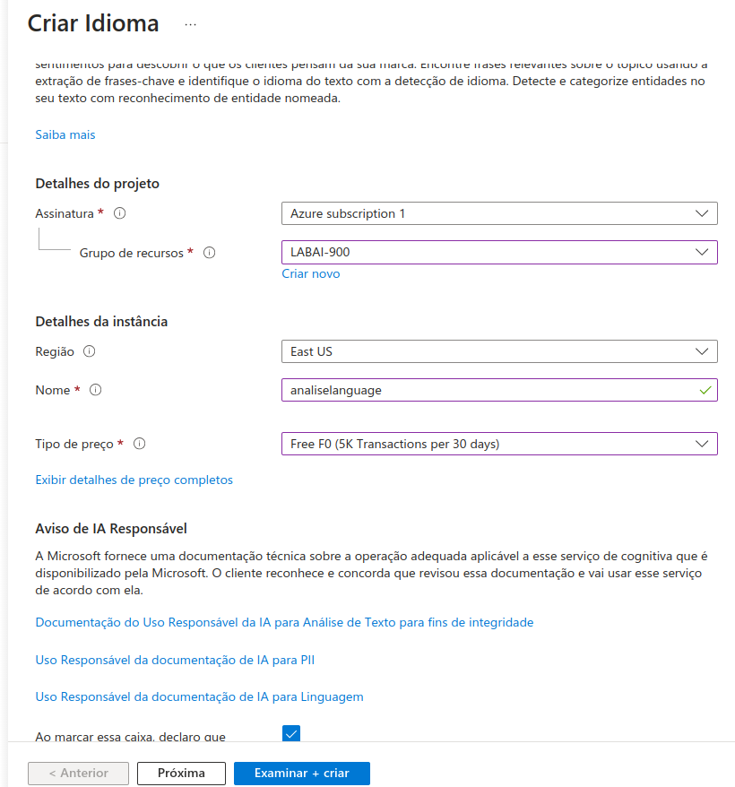
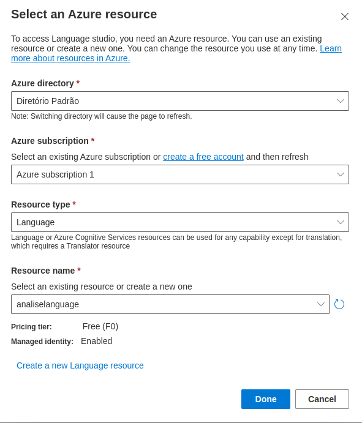
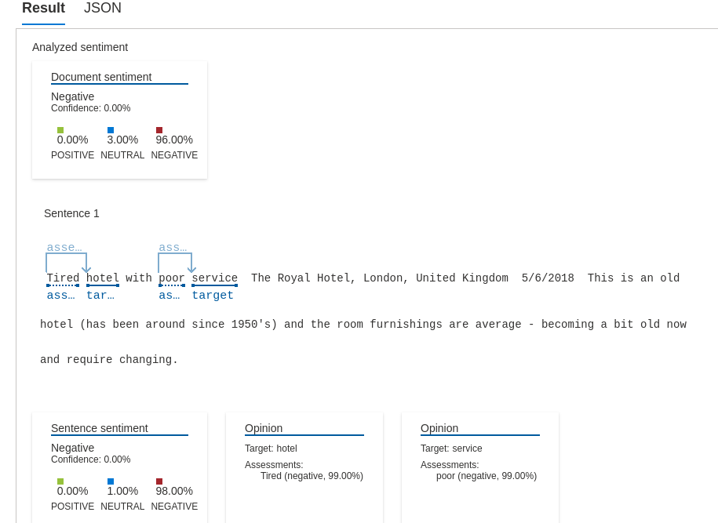

# Reconhecimento Facial e Transformacao de Imagens com Azure Studio Vision

 
&nbsp &nbsp &nbsp &nbsp

Laboratório integrante do **Bootcamp Microsoft AI Fundamentals**, oferecido pela [Dio](https://www.dio.me/) em parceria com a Microsoft.

A linguagem de inteligência artificial do Microsoft Azure é baseada em recursos NLP - Processamento de Linguagem Natural.

Realizamos configurações do Azure Language Studio para processos automatizados de processamento de linguagem natural e IA conversacional. Apresenta-se como um conjunto de ferramentas baseadas no ceńario de interface de usuário.

Reconhecimento de Entidade Nomeada - NER

## Conversão de Fala em Texto

O acesso ao portal do Estúdio de Fala pode ser feito em https://speech.microsoft.com/portal.

Começamos por criar um novo recurso clicandona engrenagem situada no canto superior direito da tela.

Uma vez criado, selecione o recurso e no canto inferior esquerdo da tela, clique em `Usar o recurso`

Na página a que for direcionado, escolhe-se a opção `Conversão de fala em texto em tempo real`.

Na opção de **Escolher um idioma** devemos alterar para o idioma que o áudio se encontra. No caso do exemplo, por gostar muito de Carlos Drummond escolhi o áudio do poema **No Meio do Caminho** - espero não ter problemas com direitos autorais. Textos mais complexos podem ser testados, bem como outros idiomas. A saída da transcrição pode ser vista na figura abaixo.

O serviço da Azure pode ser contratado para legendar a conversão de fala em texto, bem como realizar a transcrição e análise de áudios de call center.

## Análise de Texto - Language Studio

Pode-se analisar textos de comentários de clientes sobre determinados produtos ou serviços, elencando pontos positivos e negativos. Com isso, empresas e consultores têm um norte quanto aos problemas narrados pelos usários, por exemplo, identificação de pontos de melhoria, etc.

O Azure possui um serviço de idioma - **Análise de Texto** - com ferramentas para a análise em questão. Para tanto, o serviço pode ser acessado pelo Portal Azure - https://portal.azure.com/. Cria-se novo recurso a partir daí.

As configurações aqui aplicadas são vistas na imagem a seguir. Basta então clicar em `Examinar + criar`.

Com o recurso criado retornamos ao Language Studio - https://language.cognitive.azure.com/home e no ecrã que se abre preencha conforme a imagem e clique em `Done`.

Escolhemos `Classify text` e então `Analyze sentiment and mine opinions`
.

Utilizou-se um texto de avaliação de hotel, em inglês, e o resultado é mostrado a seguir. Por meio de análise de palavras positivas ou negativas, como frases, o algoritmo identificou o texto em questão como uma análise negativa.

Temos abaixo um outro texto retirado das avaliações de uma cadeira de escritório anunciada num famoso site de e-commerce brasileiro. Note que o algoritmos identifica as palavras alvo e as características referentes a elas, avaliando o quanto positiva, neutra ou negativa é a frase. Nesse caso, 100% negativa, percebendo-se que não há um único ponto positivo relatado pelo cliente.

## Referências

https://language.cognitive.azure.com/

https://speech.microsoft.com/portal

https://learn.microsoft.com/en-us/training/paths/explore-natural-language-processing/

https://learn.microsoft.com/pt-br/azure/ai-services/language-service/named-entity-recognition/overview

https://learn.microsoft.com/pt-br/azure/ai-services/language-service/overview

https://microsoftlearning.github.io/mslearn-ai-fundamentals/Instructions/Labs/09-speech.html

https://microsoftlearning.github.io/mslearn-ai-fundamentals/Instructions/Labs/06-text-analysis.html

