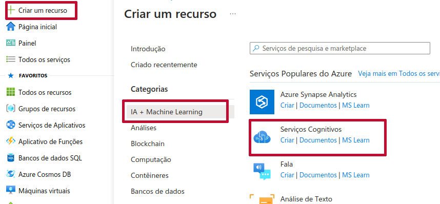

# Azure Cognitive Search: Utilizando o AI Search Para Indexação e Consulta de Dados

 
&nbsp &nbsp &nbsp &nbsp

Laboratório integrante do **Bootcamp Microsoft AI Fundamentals**, oferecido pela [Dio](https://www.dio.me/) em parceria com a Microsoft.

## Serviço de Inteligência de IA do Azure

É muito comum que um funcionário viaje a trabalho e o mesmo precisa pegar uma nota fiscal ou recibo para, posteriormente, ser reembolsado pela empresa, comprovando tudo o que gastou e a empresa precisa dar baixa nesses dados.

Usando técnicas de reconhecimento óptico de caracteres (OCR) e processamento de linguagem natural (NLP), o serviço pode identificar dados relevantes, como datas, valores e tipos de despesas, convertendo essas informações em formato digitalmente legível e estruturado. Isso permite que a empresa automatize o processo de reembolso de despesas, reduzindo erros e agilizando o fluxo de trabalho financeiro. Além disso, esses dados extraídos podem ser integrados a sistemas de gestão financeira ou relatórios de despesas, fornecendo insights valiosos sobre os gastos da empresa e facilitando a tomada de decisões.

## Realizando Buscas Cognitivas no Azure AI Search

O problema: considere que atuamos na área de TI de uma rede nacional de cafés. Diante da observação de um aumento da reclamação de clientes e do desejo de querer saber da opinião das pessoas sobre o serviço que a empresa presta em cada um dos estados que ela atua.

Iniciamos o Lab pelo portal Azure (https://portal.azure.com/) e criamos um novo recurso do Azure AI Search.

As configurações ficam como abaixo.

Em seguida criamos um recurso de AI Machine Learning > Serviços Cognitivos.

O próximo passo é criar uma conta de armazenamento. Na página inicial, buscamos no menu superior por `Contas de armazenamento`. Clique em criar na próxima página e configure conforme imagens abaixo.

**Configurando a conta de armazenamento**. Na tela do recurso, clique em `Configuração` na barra lateral. Devemos permitir o acesso anônimo ao Blob. Salve a configuração.

Crie novo Contêiner.

A documentação (ver Referências) disponibiliza um link para salvar os documentos contendo as [avaliações de clientes](https://aka.ms/mslearn-coffee-reviews). Descompacteem sua máquina e, em seguida, devemos carregá-las no contêiner criado. Selecione `Carregar`e faça o upload dos arquivos que estão no formato docx.

Retornamos a todos os recursos e, no mecanismo de busca criado, no nosso caso o *labazuresearch* clicamos em `importar dados` e realizar a indexação

De volta ao nosso labazuresearch testamos algumas pesquisas clicando no meu superior em `Gerenciador de pesquisa`

As ferramentas apresentadas nos permitem criar um serviço de IA, facilitando a consulta em documentos e declarações de clientes, por exemplo. Podem ser localizadas pessoas, frases, localizações, identificação de sentimentos. Pode-se aplicar buscas dentro do AI Search como desenvolver para utilizá-la dentro de alguma aplicação.

## Referências

https://learn.microsoft.com/en-us/training/paths/document-intelligence-knowledge-mining/

https://microsoftlearning.github.io/mslearn-ai-fundamentals/Instructions/Labs/11-ai-search.html

